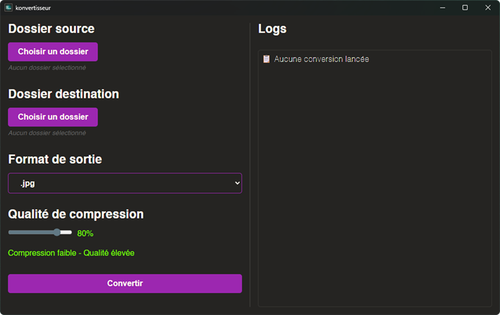

# Konvertisseur 🔄

Un convertisseur d'images simple, rapide et **100% gratuit** pour convertir vos images entre différents formats.

## C'est quoi ce truc ?

Konvertisseur est une application desktop qui vous permet de convertir vos images d'un format à un autre (JPG, PNG, WebP, AVIF, etc.) sans vous prendre la tête. Pas de pub, pas de limite, pas de compte à créer - juste un outil qui fait ce qu'il dit.

## Pourquoi c'est gratuit ?

Parce que c'est comme ça. Le code est disponible sur GitHub, vous pouvez le modifier, l'améliorer, le distribuer - bref, faite ce que vous voulez avec.

## Fonctionnalités

- ✅ Conversion entre JPG, PNG, WebP, AVIF
- ✅ Sélection de la qualité de compression
- ✅ Conversion en lot (tous les fichiers d'un dossier)
- ✅ Interface simple et intuitive
- ✅ Pas de connexion internet requise
- ✅ 100% gratuit, sans pub, sans tracking

## Aperçu



## Installation

### Windows
1. Téléchargez la dernière version depuis les [releases](https://github.com/just3mpty/konvertisseur/releases)
2. Installez le fichier `.exe`
3. C'est tout !

### Développement
Si vous voulez compiler vous-même :

```bash
# Cloner le repo
git clone https://github.com/just3mpty/konvertisseur.git
cd konvertisseur

# Installer les dépendances
npm install

# Lancer en mode développement
npm run tauri dev

# Compiler pour la production
npm run tauri build
```

## Comment ça marche ?

1. Sélectionnez le dossier source (où sont vos images)
2. Choisissez le dossier de destination
3. Sélectionnez le format de sortie
4. Ajustez la qualité si besoin
5. Cliquez sur "Convertir"
6. C'est fini !

## Technologies utilisées

- **Frontend** : React + TypeScript
- **Backend** : Tauri (Rust)
- **Build** : Vite

## Contribuer

Les contributions sont les bienvenues ! Que ce soit pour :
- Corriger des bugs
- Ajouter de nouveaux formats
- Améliorer l'interface
- Optimiser les performances

1. Fork le projet
2. Créez une branche pour votre feature
3. Committez vos changements
4. Ouvrez une Pull Request

## Licence

Ce projet est sous licence GNU GENERAL PUBLIC LICENSE.

## Support

Si vous rencontrez un problème ou avez une suggestion :
- Ouvrez une [issue](https://github.com/just3mpty/konvertisseur/issues)
- Ou contactez-moi directement sur [Instagram](https://instagram.com/3mpty.dev/) par exemple.

---

**Note** : Ce projet est maintenu sur mon temps libre. Si ça vous plaît, n'hésitez pas à mettre une ⭐ sur GitHub, ça fait toujours plaisir !
